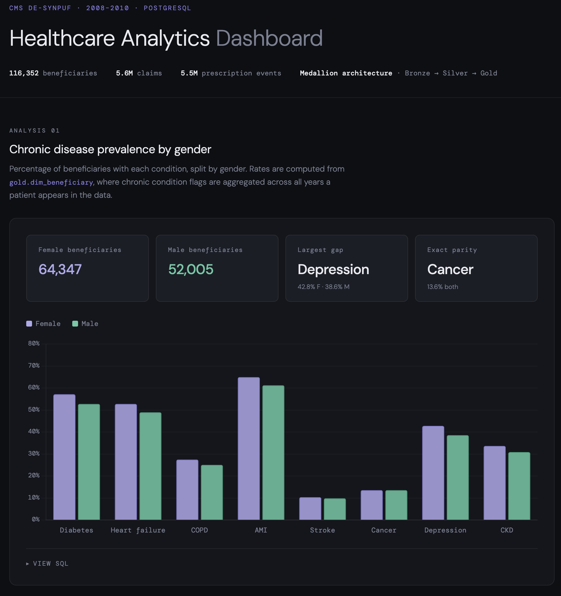
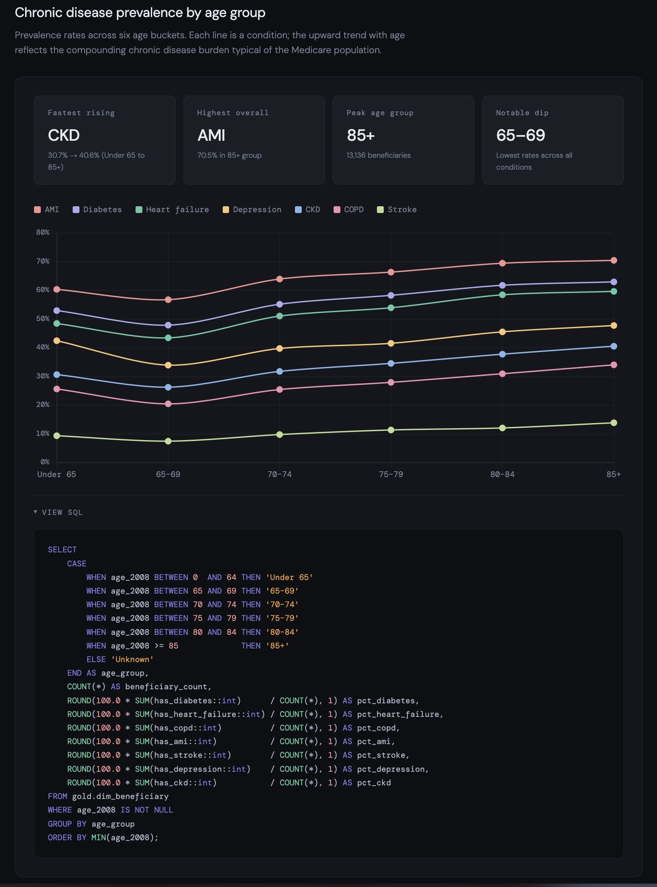

# Healthcare Data Warehouse

This project builds a production-style healthcare data warehouse from raw claims data to a dimensional model supporting analytics on:

- chronic disease prevalence
- healthcare utilization
- medication adherence (PDC)

The pipeline processes ~6M+ records and demonstrates data engineering practices including idempotent transformations, data validation, and dimensional modeling.

---

## Analytics Dashboard

An interactive dashboard built to showcase the gold layer's analytical capabilities.
Each chart includes a toggleable SQL snippet showing the exact query used to produce it.

[View live dashboard →](https://zkhechadoorian.github.io/healthcare-data-warehouse/)

### Chronic disease prevalence by gender

Compares prevalence rates across 8 chronic conditions between male and female
beneficiaries. Rates (not raw counts) are used to account for the unequal population
sizes (64K female vs 52K male). Depression shows the largest gap at 4.2 percentage
points; cancer is identical at 13.6% for both groups.



### Chronic disease prevalence by age group

Buckets 116K beneficiaries into six age groups and plots each condition as a trend
line. Every condition rises with age — with one exception: the 65–69 group shows the
lowest rates across the board, likely a survivorship effect as the newly Medicare-eligible
cohort skews healthier before disease accumulates. COPD shows the steepest climb
(25.7% → 34.1%), consistent with its cumulative nature.



---

## Architecture

This project follows a three-layer medallion architecture:

| Layer | Schema | Status | Description |
|---|---|---|---|
| Bronze | `staging` | ✅ Complete | Raw data landed as-is from source CSVs. All columns typed as `TEXT`. No transformations. |
| Silver | `silver` | ✅ Complete | Cleaned, typed, and deduplicated data. Dates cast, numerics converted, nulls handled, codes decoded. |
| Gold | `gold` | ✅ Complete | Dimensional model (facts + dimensions) optimized for analytics and reporting. |

---

## Data Sources

### CMS 2008–2010 DE-SynPUF
Synthetic Medicare claims data published by the Centers for Medicare & Medicaid Services. Based on a 5% sample of 2008 Medicare beneficiaries with claims from 2008–2010. Contains ~2.3M synthetic beneficiaries across 20 subsamples.

| File Type | Staging Table | Silver Table | Rows (Silver) |
|---|---|---|---|
| Beneficiary Summary (2008–2010) | `staging.beneficiary_*` | `silver.beneficiary` | ~2.3M |
| Inpatient Claims | `staging.inpatient_claims` | `silver.inpatient_claims` | 790K |
| Outpatient Claims | `staging.outpatient_claims` | `silver.outpatient_claims` | 4.7M |
| Carrier Claims (Physician) | `staging.carrier_claims` | `silver.carrier_claims` | 5.6M |
| Prescription Drug Events | `staging.prescription_drug_events` | `silver.prescription_drug_events` | 66K |

> Note: Carrier claims are released as two CSV files per sample (segment A and B) but are loaded into a single table.

### Kaggle Hospital Encounters
A synthetic hospital encounter dataset used to supplement the CMS claims data with additional encounter-level attributes.

| File Type | Staging Table | Silver Table |
|---|---|---|
| Hospital Encounters | `staging.kaggle_encounters` | `silver.kaggle_encounters` |

---

## Tech Stack

- **Database:** PostgreSQL (local)
- **Transformation:** SQL (CTEs, window functions, helper functions)
- **Version Control:** Git
- **Orchestration:** *(planned)*
- **Visualization:** [HTML Dashboard](https://zkhechadoorian.github.io/healthcare-data-warehouse/)

---

## Project Structure

```
healthcare-data-warehouse/
└── sql/
    ├── 01_create_staging.sql      # Bronze: creates staging tables
    ├── 02_load_staging.sql        # Bronze: loads CSVs into staging
    ├── 03_create_silver.sql       # Silver: creates schema + tables with constraints
    ├── 04_transform_silver.sql    # Silver: cleans, transforms, loads data
    ├── 05_create_gold.sql         # Gold: creates schema, dimension, fact, and aggregate tables
    └── 06_transform_gold.sql      # Gold: populates gold tables from silver layer
```

---

## Setup

### Prerequisites
- PostgreSQL installed (via Homebrew recommended on macOS)
- Source CSV files downloaded from [CMS DE-SynPUF](https://www.cms.gov/data-research/statistics-trends-and-reports/medicare-claims-synthetic-public-use-files)

##### 1. Confirm PostgreSQL is running

```bash
brew services list
```

If stopped, start it with:

```bash
brew services start postgresql@<version>
```

##### 2. Create the database

```bash
psql -d postgres -c "CREATE DATABASE healthcare_dw;"
```

##### 3. Create and load the bronze layer

```bash
psql -d healthcare_dw -f sql/01_create_staging.sql
psql -d healthcare_dw -f sql/02_load_staging.sql
```

##### 4. Create and load the silver layer

```bash
psql -d healthcare_dw -f sql/03_create_silver.sql
psql -d healthcare_dw -f sql/04_transform_silver.sql
```

##### 5. Create and load the gold layer

```bash
psql -d healthcare_dw -f sql/05_create_gold.sql
psql -d healthcare_dw -f sql/06_transform_gold.sql
```

##### 6. Verify

```bash
psql -d healthcare_dw -c "\dt silver.*"
psql -d healthcare_dw -c "\dt gold.*"
```

You should see all silver and gold tables listed.

---

## Silver Layer: Design & Implementation

The silver layer transforms raw staging data into a clean, validated foundation for analytics. Key design decisions:

### Transformation Pipeline

1. **Type Casting** — TEXT → DATE (YYYYMMDD format), NUMERIC, SMALLINT, BOOLEAN with safe error handling
2. **Null Handling** — Blank strings and sentinel values (e.g., "00000000") → NULL; missing amounts → 0
3. **Code Decoding** — Numeric codes decoded to human-readable values:
   - `BENE_SEX_IDENT_CD` (1/2) → ('M'/'F')
   - `BENE_RACE_CD` (1-6) → race names
   - Chronic condition flags (1/2) → BOOLEAN
4. **Deduplication** — Natural keys identified per table; DISTINCT ON ensures one row per key
5. **Data Validation** — CHECK constraints enforce logical rules (e.g., discharge_date ≥ admission_date)
6. **Metadata Tracking** — `_loaded_at` (timestamp) and `_row_hash` (MD5) enable change detection
7. **Indexing** — Indexes on foreign keys and commonly filtered columns (dates, beneficiary IDs)

### Key Features

- **Idempotent** — Safe to re-run; `ON CONFLICT DO NOTHING` skips already-loaded rows
- **Helper Functions** — `silver.safe_date()`, `silver.safe_numeric()`, `silver.safe_smallint()` handle edge cases
- **Referential Integrity** — FOREIGN KEY constraints link claims → beneficiaries
- **Constraints** — NOT NULL, CHECK, PRIMARY KEY, FOREIGN KEY ensure data quality
- **Row Hashing** — Each silver table stores a `_row_hash` column — an MD5 hash computed from all of a row's column values. Currently, the transform scripts use a truncate-and-reload pattern, so the hash is not yet being used for comparison logic. It is stored as forward-looking infrastructure: if the pipeline is later extended to support incremental loads, the hash will enable efficient change detection — incoming rows can be compared against the stored hash, and only rows where the hash differs need to be updated. This avoids a full reload on every run and makes the pipeline ready for incremental loading without any schema changes.

### Row Counts (Post-Transformation)

```
beneficiary               → 343K rows  (deduplicated across 3 years)
inpatient_claims          → 790K rows
outpatient_claims         → 4.7M rows
carrier_claims            → 5.6M rows
prescription_drug_events  → 66K rows
kaggle_encounters         → (loaded, count TBD)
```

---

## Gold Layer: Design & Implementation

The gold layer implements a dimensional model (star schema) on top of the silver layer, optimized for analytical queries across cost, utilization, and medication adherence.

### Transformation Pipeline

1. **Dimension Population** — Dimension tables are populated first to establish surrogate keys before facts are loaded
2. **Fact Table Joins** — Fact tables resolve surrogate keys by joining silver claims data to the relevant dimensions
3. **Aggregation** — Pre-computed aggregate tables roll up fact data by beneficiary, provider, and drug for fast reporting
4. **Idempotent** — Each section TRUNCATEs before inserting, making the transform script safe to re-run

### Table Structure

**Dimension Tables:**
- `dim_time` — Calendar dimension covering every date in 2008–2010 (year, month, quarter, week)
- `dim_beneficiary` — One row per patient; demographics and chronic condition flags aggregated across all years
- `dim_provider` — One row per provider; typed as inpatient, outpatient, or carrier
- `dim_diagnosis` — One row per ICD-9 code that appears in any claim; sparsely populated (no external code lookup)

**Fact Tables:**
- `fct_claims` — One row per claim across all three claim types (inpatient, outpatient, carrier); includes cost and utilization metrics
- `fct_prescription_events` — One row per prescription fill; includes NDC drug code, days supply, and cost

**Aggregate Tables:**
- `agg_beneficiary_year` — Costs and claim counts per patient per year, broken out by claim type and prescriptions
- `agg_provider_year` — Volume and cost metrics per provider per year
- `agg_medication_adherence` — Per patient per drug per year; computes PDC (Proportion of Days Covered) and adherence flag (PDC ≥ 0.80)

### Row Counts (Post-Transformation)

```
dim_time                  →   1,096 rows
dim_beneficiary           → 116,352 rows
dim_provider              → 621,778 rows
dim_diagnosis             →  13,228 rows

fct_claims                → 5,598,898 rows  (inpatient: 66K, outpatient: 790K, carrier: 4.7M)
fct_prescription_events   → 5,552,421 rows

agg_beneficiary_year      →   282,123 rows
agg_provider_year         → 1,294,529 rows
agg_medication_adherence  → 5,551,248 rows
```

---

## References

- [CMS DE-SynPUF User Manual](https://www.cms.gov/Research-Statistics-Data-and-Systems/Downloadable-Public-Use-Files/SynPUFs/Downloads/SynPUF_DUG.pdf)
- [Medallion Architecture](https://www.databricks.com/blog/2022/06/24/build-a-scalable-data-lakehouse-with-the-medallion-architecture.html)
- [Building a Modern Data Warehouse from Scratch](https://rihab-feki.medium.com/building-a-modern-data-warehouse-from-scratch-d18d346a7118)